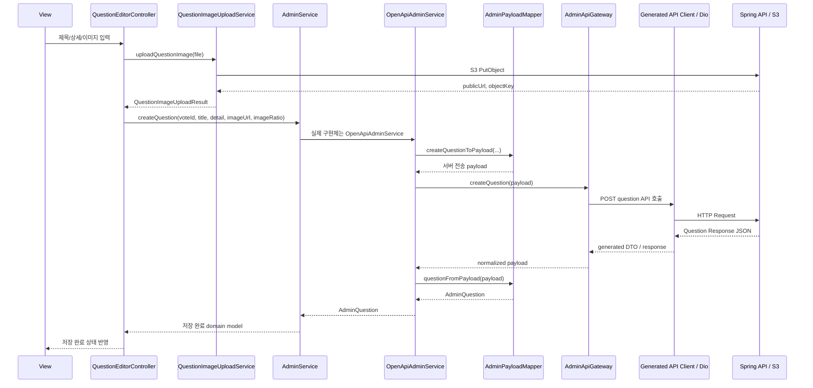

# Taglow 관리자 서비스 TDD v0.2

## 0. 문서 개요

### 문서 목적
본 문서는 **Taglow 관리자 서비스**의 기술 설계 문서이다.
Flutter Web, Riverpod, OpenAPI Generator, Dio, Spring Boot, AWS S3/Cognito를 사용해 vote와 question을 관리하는 별도 관리자 프로젝트를 구현하기 위한 구조를 정의한다.
참여자 프로젝트의 `server_service_model_controller_flow` 기준을 관리자 도메인에 맞게 적용해 View, Controller, Service, Model, Gateway, Mapper의 책임 경계를 고정한다.

### 문서 범위
이 TDD는 다음을 다룬다.

- Flutter Web 관리자 프로젝트 구조
- Riverpod 기반 controller/service 설계
- 참여자 프로젝트의 `lib/api/controller`, `lib/api/model`, `lib/api/service` 구조를 따르는 관리자 계층 설계
- Spring ADMIN 인증 연동
- vote/question CRUD 연동
- S3 question 이미지 직접 업로드
- Gateway/Mapper 기반 API 변경 흡수 구조
- Mock Service 우선 개발 구조
- OpenAPI generated client 관리
- CORS, 인증 cookie, S3 CORS 정책
- 테스트 전략과 개발 단계

### 기술 전제
- 프론트엔드: Flutter Web
- 상태관리: Riverpod
- Routing: go_router
- HTTP: Dio
- API client: OpenAPI Generator `dart-dio`
- Backend: Java Spring Boot
- API base URL: `https://vote.newdawnsoi.site`
- 이미지 저장: AWS S3
- S3 인증: Cognito/Amplify 임시 자격 증명 또는 서버 발급 upload policy
- MVP 기본 업로드 방식: 관리자 Flutter Web에서 S3 직접 업로드

---

## 1. 기술 스택

| 영역 | 기술 |
|---|---|
| Target | Desktop Web 우선, tablet 대응 |
| Frontend | Flutter Web |
| Language | Dart |
| State Management | Riverpod |
| Routing | go_router |
| HTTP Client | Dio |
| API Client | OpenAPI Generator 기반 Dart Dio client |
| Backend | Spring Boot |
| Auth | Spring session/cookie 기반 ADMIN 로그인 |
| Image Upload | AWS S3 + Cognito/Amplify |
| Mock | MockAdminService |
| Deployment | Firebase Hosting 또는 AWS Hosting |

---

## 2. 아키텍처 원칙

### 2-1. 의존성 방향

관리자 프로젝트는 참여자 프로젝트와 같은 계층 방향을 따른다.

```text
View
 → Controller
 → Service
 → Gateway / Mapper
 → Generated API Client / Dio / Browser API
```

`Model`은 선형 호출 대상이 아니라 Controller, Service, Mapper가 공유하는 안정적인 domain shape다. Controller와 Service 사이의 요청/응답은 모두 `api/model`의 관리자 domain model로 유지한다.

### 2-2. 핵심 원칙
- View는 화면 렌더링과 사용자 입력 전달만 담당한다.
- Controller는 Riverpod 상태와 UI 이벤트를 관리한다.
- Service는 관리자 domain model만 입출력으로 사용한다.
- Gateway는 서버 endpoint, path, header, generated DTO 변화를 감싼다.
- Mapper는 서버 payload와 Flutter domain model 변환만 담당한다.
- View/Controller는 Spring DTO, OpenAPI generated model, S3 SDK를 직접 알지 않는다.
- generated code는 직접 수정하지 않는다.
- API가 바뀌면 `AdminApiGateway`와 `AdminPayloadMapper`를 먼저 수정한다.
- 폴더 구조는 참여자 프로젝트와 같이 `lib/api/controller`, `lib/api/model`, `lib/api/service`를 기본 축으로 둔다.
- Mock과 OpenAPI 구현체는 같은 `AdminService` 계약을 구현하므로 Controller/View가 구현체를 구분하지 않는다.

---

## 3. 전체 아키텍처

```text
view/
  AdminLoginPage / VoteListPage / VoteDetailPage / QuestionEditorPage
    ↓ user action
api/controller/
  AuthController / VoteListController / VoteDetailController / QuestionEditorController
    ↓ calls domain contract
api/service/
  AdminServiceProvider
    └─ AdminService contract
         ├─ MockAdminService
         └─ OpenApiAdminService
              ├─ AdminPayloadMapper
              └─ AdminApiGateway
                   └─ Generated OpenAPI Client / Dio
    ↓ optional media use case
  QuestionImageUploadService
    └─ Amplify Storage / S3 Web API
    ↓
Spring Boot API / AWS S3 / Local Mock

api/model/
  AdminUser / AdminAuthSession / AdminVote / AdminQuestion / QuestionImageUploadResult
```

`api/model`의 domain model은 Controller와 Service가 공유하는 계약이다. Generated DTO와 raw payload는 Gateway/Mapper 내부에만 머물러야 한다.

### 3-1. question 생성 요청과 응답 흐름



### 3-2. 계층 책임

| 계층 | 책임 | 직접 알면 안 되는 것 |
|---|---|---|
| View | 화면 렌더링, 입력 전달, Controller 상태 구독 | endpoint, DTO, S3 SDK |
| Controller | Riverpod 상태, validation, 오류/로딩, Service 호출 | generated client, raw JSON payload |
| Model | Controller와 Service가 공유하는 stable domain shape | 서버 transport 세부사항 |
| Service | 유스케이스 조합, Mock/OpenAPI 구현 교체, Mapper/Gateway 연결 | Widget, 화면 layout |
| Mapper | 서버 payload와 domain model 변환 | 네트워크 호출, provider |
| Gateway | endpoint/path/header/cookie/generated DTO 변화 흡수 | View state, Widget |

---

## 4. 프로젝트 구조

권장 관리자 프로젝트 구조:

```text
lib/
├── main.dart
├── app.dart
│
├── view/
│   ├── auth/
│   │   └── admin_login_page.dart
│   ├── votes/
│   │   ├── vote_list_page.dart
│   │   ├── vote_detail_page.dart
│   │   └── widgets/
│   │       ├── vote_form_dialog.dart
│   │       ├── vote_status_control.dart
│   │       └── participant_url_panel.dart
│   ├── questions/
│   │   ├── question_editor_page.dart
│   │   └── widgets/
│   │       ├── question_form.dart
│   │       ├── question_image_picker.dart
│   │       └── question_preview_panel.dart
│   └── diagnostics/
│       └── admin_diagnostics_page.dart
│
├── api/
│   ├── controller/
│   │   ├── auth_controller.dart
│   │   ├── vote_list_controller.dart
│   │   ├── vote_detail_controller.dart
│   │   └── question_editor_controller.dart
│   ├── model/
│   │   ├── admin_user.dart
│   │   ├── admin_auth_session.dart
│   │   ├── admin_vote.dart
│   │   ├── admin_question.dart
│   │   ├── vote_status.dart
│   │   └── question_image_upload_result.dart
│   ├── service/
│   │   ├── admin_service.dart
│   │   ├── admin_service_provider.dart
│   │   ├── mock_admin_service.dart
│   │   ├── openapi_admin_service.dart
│   │   ├── admin_api_gateway.dart
│   │   ├── admin_payload_mapper.dart
│   │   ├── question_image_upload_service.dart
│   │   └── generated_api_client_factory.dart
│   └── generated/
│       └── tagvote_api_client/
│
├── utils/
│   ├── image_ratio_reader.dart
│   ├── admin_url_builder.dart
│   ├── input_validator.dart
│   └── clipboard_helper.dart
│
└── theme/
    ├── app_theme.dart
    ├── admin_colors.dart
    ├── admin_typography.dart
    └── admin_spacing.dart
```

문서와 운영 지침:

```text
dev/
├── Taglow_admin_PRD.md
├── Taglow_admin_TDD.md
├── tagvote-openapi.json
├── sync_tagvote_openapi.sh
└── aws_s3_question_image_upload_setup.md
```

S3 관련 구현과 지침은 관리자 프로젝트로 이동한다. 참여자 프로젝트는 참가자 미디어 업로드가 필요한 경우에만 별도 경량 업로드 wrapper를 유지한다.

---

## 5. Domain Model 설계

모든 domain model은 참여자 프로젝트와 동일하게 `lib/api/model` 아래에 둔다. Controller와 Service는 이 model만 공유하고, generated DTO나 raw payload를 public contract로 노출하지 않는다.

### 5-1. AdminUser

```dart
class AdminUser {
  const AdminUser({
    required this.id,
    required this.name,
    required this.roles,
  });

  final String id;
  final String name;
  final Set<String> roles;

  bool get isAdmin => roles.contains('ADMIN');
}
```

### 5-2. AdminAuthSession

```dart
class AdminAuthSession {
  const AdminAuthSession({
    required this.user,
    required this.isLoading,
    this.errorMessage,
  });

  final AdminUser? user;
  final bool isLoading;
  final String? errorMessage;

  bool get isAuthenticated => user != null;
  bool get canManage => user?.isAdmin ?? false;
}
```

### 5-3. AdminVote

```dart
enum VoteStatus { progress, end }

class AdminVote {
  const AdminVote({
    required this.id,
    required this.name,
    required this.status,
    required this.createdByUserId,
    this.createdAt,
    this.updatedAt,
  });

  final String id;
  final String name;
  final VoteStatus status;
  final String createdByUserId;
  final DateTime? createdAt;
  final DateTime? updatedAt;
}
```

### 5-4. AdminQuestion

```dart
class AdminQuestion {
  const AdminQuestion({
    required this.id,
    required this.voteId,
    required this.title,
    required this.detail,
    required this.imageUrl,
    required this.imageRatio,
    this.createdAt,
    this.updatedAt,
  });

  final String id;
  final String voteId;
  final String title;
  final String detail;
  final String imageUrl;
  final double imageRatio;
  final DateTime? createdAt;
  final DateTime? updatedAt;
}
```

### 5-5. QuestionImageUploadResult

```dart
class QuestionImageUploadResult {
  const QuestionImageUploadResult({
    required this.objectKey,
    required this.publicUrl,
    required this.contentType,
    required this.sizeBytes,
    required this.imageWidth,
    required this.imageHeight,
    required this.imageRatio,
  });

  final String objectKey;
  final String publicUrl;
  final String contentType;
  final int sizeBytes;
  final int imageWidth;
  final int imageHeight;
  final double imageRatio;
}
```

---

## 6. Routing 설계

```text
/login
  → 관리자 로그인

/votes
  → vote 목록

/votes/new
  → 새 vote 생성

/votes/:voteId
  → vote 상세 및 question 목록

/votes/:voteId/questions/new
  → question 생성

/votes/:voteId/questions/:questionId
  → question 수정

/diagnostics
  → API/S3/CORS 진단
```

라우트 guard:
- 인증되지 않은 사용자는 `/login`으로 이동한다.
- 로그인했지만 `ADMIN` role이 없으면 접근 불가 화면을 표시한다.
- `/login`에서 이미 인증된 ADMIN은 `/votes`로 이동한다.

---

## 7. Controller 설계

## 7-1. AuthController

책임:
- 로그인 제출
- 현재 사용자 조회
- 로그아웃
- ADMIN role 확인
- 인증 오류 상태 관리

상태:
- `isLoading`
- `user`
- `errorMessage`

## 7-2. VoteListController

책임:
- vote 목록 로드
- vote 생성
- 로딩/빈 상태/오류/재시도 상태 관리

상태:
- `votes`
- `isLoading`
- `isCreating`
- `errorMessage`

## 7-3. VoteDetailController

책임:
- vote 상세 로드
- question 목록 로드
- vote 이름/상태 수정
- vote 삭제
- 참여자 URL 생성
- 공개 API 미리보기 호출

상태:
- `vote`
- `questions`
- `participantUrl`
- `publicPreview`
- `isSaving`
- `errorMessage`

## 7-4. QuestionEditorController

책임:
- question 작성/수정 draft 관리
- 이미지 선택
- S3 업로드 호출
- imageRatio 계산 결과 보관
- question 생성/수정 저장
- 업로드 실패와 API 저장 실패 분리

상태:
- `title`
- `detail`
- `imageUploadResult`
- `isUploading`
- `isSaving`
- `validationErrors`
- `errorMessage`

---

## 8. Service 계약

### 8-1. AdminService

```dart
abstract class AdminService {
  Future<AdminUser> login({
    required String name,
    required String password,
  });

  Future<AdminUser?> fetchCurrentUser();

  Future<void> logout();

  Future<List<AdminVote>> fetchVotes();

  Future<AdminVote> createVote({required String name});

  Future<AdminVote> fetchVote(String voteId);

  Future<AdminVote> updateVote({
    required String voteId,
    String? name,
    VoteStatus? status,
  });

  Future<void> deleteVote(String voteId);

  Future<List<AdminQuestion>> fetchQuestions(String voteId);

  Future<AdminQuestion> createQuestion({
    required String voteId,
    required String title,
    required String detail,
    required String imageUrl,
    required double imageRatio,
  });

  Future<AdminQuestion> updateQuestion({
    required String questionId,
    String? title,
    String? detail,
    String? imageUrl,
    double? imageRatio,
  });

  Future<void> deleteQuestion(String questionId);

  Future<Map<String, Object?>> fetchPublicVoteDisplay(String voteId);

  Future<List<Map<String, Object?>>> fetchPublicQuestions(String voteId);
}
```

### 8-2. MockAdminService

목적:
- Spring API, CORS, S3 없이 관리자 UI를 먼저 개발한다.
- vote/question 생성/수정/삭제 흐름을 로컬 in-memory로 재현한다.
- 실패 상태 테스트를 위해 debug flag를 제공한다.

정책:
- Mock에서도 `ADMIN` role이 없는 사용자는 관리 기능을 막는다.
- Mock question 생성은 fake S3 URL을 사용할 수 있다.
- Controller/View는 Mock인지 OpenAPI인지 알지 못한다.

### 8-3. OpenApiAdminService

책임:
- `AdminApiGateway` 호출
- `AdminPayloadMapper` 변환
- Service domain 계약 유지
- 인증 session/cookie 유지가 필요한 경우 Dio 설정에 위임

OpenApiAdminService는 endpoint 문자열을 직접 흩뿌리지 않고 Gateway에 위임한다.

### 8-4. AdminServiceProvider

책임:
- 실행 모드에 따라 `MockAdminService` 또는 `OpenApiAdminService`를 주입한다.
- `AdminApiGateway`, `AdminPayloadMapper`, `GeneratedApiClientFactory`를 한 곳에서 wiring한다.
- Controller는 provider를 통해 `AdminService` 계약만 의존한다.

정책:
- provider wiring 변경은 View/Controller import 구조를 바꾸지 않아야 한다.
- Mock과 OpenAPI 전환은 `--dart-define` 또는 build flavor로 제어한다.

---

## 9. Gateway / Mapper 설계

## 9-1. AdminApiGateway

`AdminApiGateway`는 low-level API adapter다.

역할:
- Dio 또는 generated client 호출
- endpoint path 관리
- auth credential/cookie 설정
- 요청 header 설정
- raw payload 반환

예시:

```dart
abstract class AdminApiGateway {
  Future<Map<String, Object?>> login(Map<String, Object?> payload);
  Future<Map<String, Object?>> me();
  Future<void> logout();

  Future<List<Map<String, Object?>>> fetchVotes();
  Future<Map<String, Object?>> createVote(Map<String, Object?> payload);
  Future<Map<String, Object?>> fetchVote(String voteId);
  Future<Map<String, Object?>> updateVote({
    required String voteId,
    required Map<String, Object?> payload,
  });
  Future<void> deleteVote(String voteId);

  Future<List<Map<String, Object?>>> fetchQuestions(String voteId);
  Future<Map<String, Object?>> createQuestion(Map<String, Object?> payload);
  Future<Map<String, Object?>> updateQuestion({
    required String questionId,
    required Map<String, Object?> payload,
  });
  Future<void> deleteQuestion(String questionId);

  Future<Map<String, Object?>> fetchPublicVoteDisplay(String voteId);
  Future<List<Map<String, Object?>>> fetchPublicQuestions(String voteId);
}
```

## 9-2. AdminPayloadMapper

`AdminPayloadMapper`는 서버 payload와 Flutter domain model 변환만 담당한다.

역할:
- `VoteResponse` payload -> `AdminVote`
- `QuestionResponse` payload -> `AdminQuestion`
- `AuthUserResponse` 또는 `UserResponse` payload -> `AdminUser`
- create/update form value -> request payload
- 서버 field alias 흡수: `id`/`voteId`, `name`/`voteName`, `detail`/`description`

정책:
- Mapper는 네트워크 호출을 하지 않는다.
- Mapper는 Widget, Controller, Dio를 import하지 않는다.
- 서버 타입 변화는 Mapper 테스트로 먼저 보호한다.

## 9-3. API 변경 흡수 예시

서버가 `QuestionResponse.imageRatio`를 integer에서 double로 바꾸거나, `detail`을 `description`으로 바꾸면 다음만 수정한다.

- `AdminApiGateway` endpoint/path/header
- `AdminPayloadMapper` field alias와 타입 파싱
- 관련 mapper/gateway 테스트

수정하지 않아야 하는 영역:
- View form widget
- Controller state shape
- `AdminQuestion` domain model

---

## 10. 현재 API 계약

기준 서버:

```text
https://vote.newdawnsoi.site
```

### 10-1. Auth API

| 동작 | API |
|---|---|
| 로그인 | `POST /api/auth/login` |
| 현재 사용자 조회 | `GET /api/auth/me` 또는 `GET /api/users/me` |
| 로그아웃 | `POST /api/auth/logout` |

로그인 응답에 token 필드가 없으므로 MVP 문서는 Spring session/cookie 인증을 기본값으로 둔다.
Dio Web은 credential/cookie 정책을 별도로 검증해야 한다.

### 10-2. Vote API

| 동작 | API |
|---|---|
| vote 목록 | `GET /api/votes` |
| vote 상세 | `GET /api/votes/{voteId}` |
| vote 수정 | `PATCH /api/votes/{voteId}` |
| vote 삭제 | `DELETE /api/votes/{voteId}` |
| vote 생성 | ADMIN 보호 create endpoint 필요 |

현재 OpenAPI에는 `POST /api/public/votes`가 존재하지만, 관리자 서비스에서는 public 생성 API를 사용하지 않는 것을 원칙으로 한다.
서버는 ADMIN 권한을 요구하는 vote 생성 endpoint를 제공해야 한다.

### 10-3. Question API

| 동작 | API |
|---|---|
| vote의 question 목록 | `GET /api/votes/{voteId}/questions` |
| question 생성 | `POST /api/questions` |
| question 상세 | `GET /api/questions/{questionId}` |
| question 수정 | `PATCH /api/questions/{questionId}` |
| question 삭제 | `DELETE /api/questions/{questionId}` |

### 10-4. Public verification API

| 검증 | API |
|---|---|
| 참여자/스탠바이미 display 데이터 | `GET /api/public/votes/{voteId}/display` |
| 공개 question 목록 | `GET /api/public/votes/{voteId}/questions` |

관리자 저장 결과는 위 public API에서 확인 가능해야 한다.

### 10-5. imageRatio 수정 필요

현재 OpenAPI:

```json
"imageRatio": {
  "type": "integer",
  "format": "int64"
}
```

필요 계약:

```json
"imageRatio": {
  "type": "number",
  "format": "double"
}
```

이유:
- 참여자/스탠바이미 화면은 원본 이미지 비율로 반응형 bounds를 계산한다.
- `0.5`, `1.3333`, `1.7777` 같은 소수 비율이 필요하다.
- integer ratio는 이미지 표시 왜곡 또는 저장 실패를 유발할 수 있다.

---

## 11. S3 질문 이미지 업로드 설계

## 11-1. 책임 이동

관리자 프로젝트가 질문 이미지 업로드를 소유한다.
따라서 S3 관련 구현과 문서는 관리자 프로젝트로 이동한다.

이동 대상 예시:
- `s3_media_upload_service.dart`의 공통 S3 업로드 로직
- `aws_s3_media_upload_setup.md`의 S3/Cognito/CORS/IAM 지침
- question image prefix 정책

참여자 프로젝트가 사진 태그 업로드를 유지해야 한다면, 관리자 프로젝트와 공통 package로 분리하거나 각 프로젝트에 최소 wrapper만 둔다.

## 11-2. 업로드 흐름

```text
관리자 이미지 선택
→ 이미지 bytes 읽기
→ 원본 width/height 읽기
→ imageRatio = width / height 계산
→ S3 public/question-images/{identityId}/{uuid.ext} 업로드
→ publicUrl 반환
→ POST /api/questions에 imageUrl과 imageRatio 전송
```

## 11-3. S3 설정 값

```sh
--dart-define=TAGLOW_API_BASE_URL=https://vote.newdawnsoi.site
--dart-define=TAGLOW_AWS_REGION=ap-northeast-2
--dart-define=TAGLOW_COGNITO_IDENTITY_POOL_ID=ap-northeast-2:9015b01d-8637-43f6-a4cb-2e77be70a6f2
--dart-define=TAGLOW_S3_BUCKET=tagvote-content-bucket
--dart-define=TAGLOW_S3_PUBLIC_BASE_URL=https://tagvote-content-bucket.s3.ap-northeast-2.amazonaws.com
--dart-define=TAGLOW_S3_QUESTION_IMAGE_PREFIX=public/question-images
```

## 11-4. IAM 정책

관리자 question 이미지 업로드 role은 최소한 다음 prefix에 `s3:PutObject` 권한이 있어야 한다.

```json
{
  "Effect": "Allow",
  "Action": ["s3:PutObject"],
  "Resource": [
    "arn:aws:s3:::tagvote-content-bucket/public/question-images/${cognito-identity.amazonaws.com:sub}/*"
  ]
}
```

이미지 공개 표시가 필요한 경우 CloudFront 또는 S3 public read 정책이 별도로 필요하다.

## 11-5. 오류 처리

| 실패 | 처리 |
|---|---|
| 파일 선택 취소 | draft 유지, 오류 없음 |
| 이미지 디코딩 실패 | 지원하지 않는 이미지 안내 |
| S3 업로드 실패 | 업로드 재시도 버튼 |
| S3 성공 후 API 저장 실패 | 업로드 URL 유지 후 저장 재시도 |
| public URL 접근 실패 | question 저장 전 경고 또는 진단 화면 안내 |

---

## 12. 인증과 Dio 정책

### 12-1. Spring session/cookie

MVP는 Spring session/cookie 인증을 기본값으로 문서화한다.

요구사항:
- 로그인 요청 후 브라우저가 cookie를 보관할 수 있어야 한다.
- cross-origin 배포라면 서버 CORS가 credential을 허용해야 한다.
- Dio Web adapter에서 credential 포함 설정을 검증해야 한다.

### 12-2. CORS

관리자 배포 origin은 Spring CORS allowlist에 포함되어야 한다.

허용 메서드:

```text
GET, POST, PATCH, DELETE, OPTIONS
```

허용 header:

```text
Content-Type, Authorization, X-Requested-With
```

Spring session/cookie를 cross-origin으로 쓸 경우:

```text
Access-Control-Allow-Credentials: true
```

S3 bucket CORS는 Spring CORS와 별도로 설정한다.

---

## 13. URL 생성 정책

### 13-1. 참여자 URL

```text
https://taglow-acca6.web.app/e/{voteId}
```

관리자 프로젝트는 `TAGLOW_PARTICIPANT_BASE_URL` 환경값으로 base URL을 받는다.

```sh
--dart-define=TAGLOW_PARTICIPANT_BASE_URL=https://taglow-acca6.web.app
```

### 13-2. 스탠바이미 URL

스탠바이미 프로젝트 배포 도메인이 확정되면 다음 환경값을 사용한다.

```sh
--dart-define=TAGLOW_DISPLAY_BASE_URL=https://{display-domain}
```

MVP에서는 voteId 기반 전체 display URL을 표시한다.
항목별 QR은 post-MVP로 둔다.

---

## 14. OpenAPI 동기화와 generated code

### 14-1. 동기화 순서
1. Spring `/v3/api-docs`를 `dev/tagvote-openapi.json`에 동기화한다.
2. 관리자 API endpoint와 schema 변경 여부를 확인한다.
3. OpenAPI Generator로 Dart Dio client를 생성한다.
4. generated code는 `api/generated/tagvote_api_client` 아래에 둔다.
5. generated code는 직접 수정하지 않는다.
6. endpoint/DTO 변화는 `AdminApiGateway`와 `AdminPayloadMapper`에서 흡수한다.

### 14-2. generator 설정 예시

```yaml
generatorName: dart-dio
outputDir: ./lib/api/generated/tagvote_api_client
inputSpec: ./dev/tagvote-openapi.json

additionalProperties:
  pubName: tagvote_api_client
  pubVersion: 1.0.0
  pubDescription: "Taglow admin API client"
  nullableFields: true
  useEnumExtension: true
```

---

## 15. UI 설계 원칙

관리자 서비스는 참여자용 랜딩 페이지처럼 만들지 않는다.
첫 화면은 로그인 후 바로 운영 업무를 수행하는 도구여야 한다.

원칙:
- 화면은 desktop/tablet 중심의 작업형 UI로 만든다.
- vote 목록은 테이블 또는 compact list를 사용한다.
- primary action은 새 vote, 새 question, 저장, 복사로 제한한다.
- 이미지 업로드는 진행률과 완료 상태를 명확히 보여준다.
- 카드 안에 카드를 중첩하지 않는다.
- 긴 설명문 대신 label, helper text, validation message를 사용한다.
- 운영자가 반복 작업을 빠르게 수행할 수 있도록 scan 가능한 layout을 우선한다.

---

## 16. 테스트 전략

### 16-1. Unit test

- `AdminPayloadMapper` field alias와 타입 변환
- `AdminApiGateway` endpoint path와 request body
- `AdminUrlBuilder` 참여자 URL 생성
- `ImageRatioReader` 이미지 width/height 비율 계산
- `QuestionImageUploadService` publicUrl 생성
- vote/question form validator
- `AdminServiceProvider` mock/openapi 구현체 선택

### 16-2. Controller test

- 로그인 성공/실패
- ADMIN role 없는 사용자 차단
- vote 목록 로드/생성/수정/삭제
- question 이미지 업로드 후 저장
- S3 업로드 실패와 API 저장 실패 분리
- 공개 API 미리보기 성공/실패

### 16-3. Widget test

- 로그인 화면 validation
- vote 목록 loading/empty/error/success
- vote 상세의 URL 복사 버튼
- question editor 이미지 선택/미리보기/저장 버튼 상태
- 저장 실패 시 재시도 UI

### 16-4. Integration check

- 실제 Spring API login
- vote 생성 후 public display API 확인
- question 이미지 S3 업로드 후 참여자 화면 이미지 표시
- 관리자 배포 origin에서 Spring CORS와 S3 CORS 확인

---

## 17. 개발 단계

## Phase 1. 문서와 프로젝트 분리
- 관리자 전용 Flutter Web 프로젝트 생성
- PRD/TDD 복사 및 관리자 도메인으로 정리
- S3 업로드 지침과 구현 위치를 관리자 프로젝트로 이동

## Phase 2. Mock 관리자 플로우
- `lib/api/model` 아래 Admin domain model 작성
- MockAdminService 작성
- AdminServiceProvider 작성
- 로그인, vote 목록, vote 상세, question editor UI 구현
- 이미지 업로드는 fake URL로 먼저 연결

## Phase 3. OpenAPI 연결
- OpenAPI spec 동기화
- generated client 생성
- AdminApiGateway 작성
- AdminPayloadMapper 작성
- OpenApiAdminService 연결
- Controller는 `AdminService` provider wiring만 통해 OpenAPI 구현을 사용하도록 확인

## Phase 4. S3 이미지 업로드
- QuestionImageUploadService 구현
- Cognito/Amplify configure
- imageRatio 계산
- question create/update payload 연결

## Phase 5. 운영 검증
- 배포 origin CORS 확인
- Spring session/cookie 인증 확인
- S3 CORS 확인
- public API 미리보기와 참여자 URL end-to-end 확인

---

## 18. 리스크와 대응

| 리스크 | 영향 | 대응 |
|---|---|---|
| vote 생성 endpoint가 public | 관리자 권한 우회 가능 | ADMIN 보호 create endpoint 요구 |
| imageRatio integer 타입 | 반응형 이미지 표시 오류 | backend schema를 number/double로 변경 |
| Spring cookie CORS 미설정 | 관리자 로그인 유지 실패 | credentials 허용 및 SameSite/Secure 정책 확인 |
| S3 public URL 접근 불가 | 참여자 화면 이미지 미표시 | CloudFront 또는 public read 정책 확정 |
| generated DTO 변경 | Flutter UI 수정 범위 증가 | Gateway/Mapper 테스트로 흡수 |
| S3 업로드 성공 후 API 실패 | 고아 object 증가 | 저장 재시도, post-MVP cleanup job 검토 |

---

## 19. 최종 구현 기준 요약

1. 관리자 프로젝트는 참여자/스탠바이미와 분리한다.
2. ADMIN 로그인 없이는 vote/question 관리 화면에 접근할 수 없다.
3. 폴더 구조는 `lib/api/controller`, `lib/api/model`, `lib/api/service`를 기본 축으로 둔다.
4. View/Controller는 서버 DTO와 generated client를 직접 알지 않는다.
5. API 변경은 `AdminApiGateway`와 `AdminPayloadMapper`에서 우선 흡수한다.
6. question 이미지는 S3에 직접 업로드하고 서버에는 URL과 비율만 저장한다.
7. 저장된 vote/question은 public display/question API에서 확인 가능해야 한다.
8. Mock service로 전체 관리자 flow를 서버 없이 먼저 개발할 수 있어야 한다.
