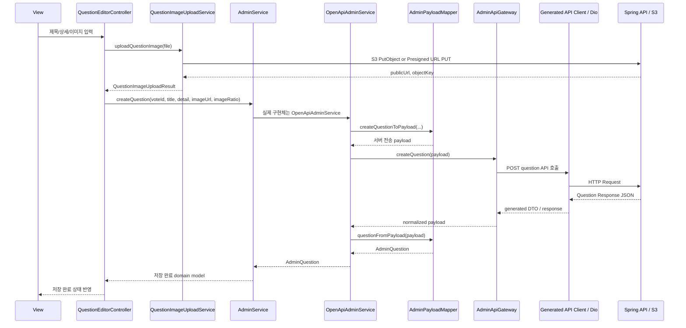
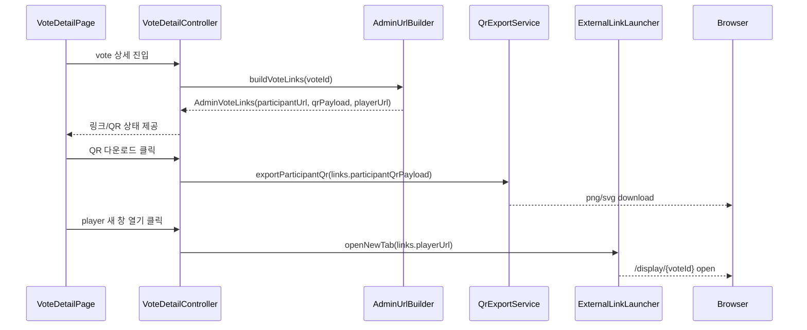

# Taglow 관리자 서비스 TDD v1.0

## 0. 문서 개요

### 문서 목적
본 문서는 **Taglow 관리자 서비스**의 최종 기술 설계 문서이다.  
Flutter Web, Riverpod, OpenAPI Generator, Dio, Spring Boot, AWS S3/Cognito 또는 presigned URL 구조를 사용해 vote와 question을 관리하는 별도 관리자 프로젝트를 구현하기 위한 구조를 정의한다.

본 TDD는 기존 관리자 서비스의 vote/question CRUD 구조에 더해, 현장 운영에 필요한 **참여자 링크 생성, 참여자 QR 코드 생성/다운로드, 스탠바이미 player 링크 생성/미리보기** 기능을 관리자 MVP의 정식 범위로 포함한다.

### 문서 범위
이 TDD는 다음을 다룬다.

- Flutter Web 관리자 프로젝트 구조
- Riverpod 기반 controller/service 설계
- 참여자 프로젝트의 `lib/api/controller`, `lib/api/model`, `lib/api/service` 구조를 따르는 관리자 계층 설계
- Spring 로그인 인증 연동
- vote/question CRUD 연동
- S3 question 이미지 업로드
- 참여자 URL 생성
- 참여자 QR 코드 렌더링 및 export
- 스탠바이미 player URL 생성 및 새 창 열기
- Gateway/Mapper 기반 API 변경 흡수 구조
- Mock Service 우선 개발 구조
- OpenAPI generated client 관리
- 회원가입 API 연결. 신규 사용자는 서버 정책에 따라 `USER` role로 생성되며, 클라이언트는 `ADMIN` 승격을 수행하지 않는다.
- CORS, 인증 cookie, CSRF, S3 CORS 정책
- 테스트 전략과 개발 단계

### 기술 전제
- 프론트엔드: Flutter Web
- 상태관리: Riverpod
- Routing: go_router
- HTTP: Dio
- API client: OpenAPI Generator `dart-dio`
- Backend: Java Spring Boot
- API base URL: `https://vote.newdawnsoi.site`
- 이미지 저장: AWS S3
- S3 인증: Cognito/Amplify 임시 자격 증명 또는 서버 발급 presigned URL/upload policy
- MVP 기본 업로드 방식: 관리자 Flutter Web에서 S3 직접 업로드
- QR 생성: 관리자 Flutter Web에서 참여자 URL을 payload로 렌더링
- player URL: voteId 기반 `/display/{voteId}` route 사용

---

## 1. 기술 스택

| 영역 | 기술 |
|---|---|
| Target | Desktop Web 우선, tablet 대응 |
| Frontend | Flutter Web |
| Language | Dart |
| State Management | Riverpod |
| Routing | go_router |
| HTTP Client | Dio |
| API Client | OpenAPI Generator 기반 Dart Dio client |
| Backend | Spring Boot |
| Auth | Spring session/cookie 기반 USER/ADMIN 로그인 또는 token 방식 |
| Image Upload | AWS S3 + Cognito/Amplify 또는 presigned URL |
| QR Rendering | qr_flutter 또는 동등한 QR rendering package |
| QR Export | PNG 기본, SVG/URL copy fallback |
| External Link | Browser new tab launch helper 또는 url_launcher web |
| Mock | MockAdminService |
| Deployment | Firebase Hosting 또는 AWS Hosting |

---

## 2. 아키텍처 원칙

### 2-1. 의존성 방향

관리자 프로젝트는 참여자 프로젝트와 같은 계층 방향을 따른다.

```text
View
 → Controller
 → Service
 → Gateway / Mapper
 → Generated API Client / Dio / Browser API / Storage API
```

`Model`은 선형 호출 대상이 아니라 Controller, Service, Mapper가 공유하는 안정적인 domain shape다. Controller와 Service 사이의 요청/응답은 모두 `api/model`의 관리자 domain model로 유지한다.

### 2-2. 핵심 원칙
- View는 화면 렌더링과 사용자 입력 전달만 담당한다.
- Controller는 Riverpod 상태와 UI 이벤트를 관리한다.
- Service는 관리자 domain model만 입출력으로 사용한다.
- Gateway는 서버 endpoint, path, header, generated DTO 변화를 감싼다.
- Mapper는 서버 payload와 Flutter domain model 변환만 담당한다.
- View/Controller는 Spring DTO, OpenAPI generated model, S3 SDK를 직접 알지 않는다.
- generated code는 직접 수정하지 않는다.
- API가 바뀌면 `AdminApiGateway`와 `AdminPayloadMapper`를 먼저 수정한다.
- 폴더 구조는 참여자 프로젝트와 같이 `lib/api/controller`, `lib/api/model`, `lib/api/service`를 기본 축으로 둔다.
- Mock과 OpenAPI 구현체는 같은 `AdminService` 계약을 구현하므로 Controller/View가 구현체를 구분하지 않는다.
- 참여자 링크, QR 코드, player 링크는 서버 저장 API가 아니라 `AdminUrlBuilder`, `QrExportService`, `ExternalLinkLauncher` 계층에서 처리한다.

---

## 3. 전체 아키텍처

```text
view/
  LoginPage / SignupPage / VoteListPage / VoteDetailPage / QuestionEditorPage
    ↓ user action
api/controller/
  AuthController / VoteListController / VoteDetailController / QuestionEditorController
    ↓ calls domain contract
api/service/
  AdminServiceProvider
    └─ AdminService contract
         ├─ MockAdminService
         └─ OpenApiAdminService
              ├─ AdminPayloadMapper
              └─ AdminApiGateway
                   └─ Generated OpenAPI Client / Dio
    ↓ optional media use case
  QuestionImageUploadService
    └─ Amplify Storage / S3 Web API / Presigned URL PUT
    ↓ optional operation link use case
  QrExportService / ExternalLinkLauncher
    └─ QR renderer / Browser download / Browser new tab
    ↓
Spring Boot API / AWS S3 / Local Mock / Browser API

api/model/
  AdminUser / AdminAuthSession / AdminVote / AdminQuestion
  AdminVoteLinks / QrExportResult / QuestionImageUploadResult
```

`api/model`의 domain model은 Controller와 Service가 공유하는 계약이다. Generated DTO와 raw payload는 Gateway/Mapper 내부에만 머물러야 한다.

### 3-1. question 생성 요청과 응답 흐름



### 3-2. 운영 링크/QR 생성 흐름



### 3-3. 계층 책임

| 계층 | 책임 | 직접 알면 안 되는 것 |
|---|---|---|
| View | 화면 렌더링, 입력 전달, Controller 상태 구독 | endpoint, DTO, S3 SDK, raw storage API |
| Controller | Riverpod 상태, validation, 오류/로딩, Service 호출, 링크/QR 이벤트 관리 | generated client, raw JSON payload |
| Model | Controller와 Service가 공유하는 stable domain shape | 서버 transport 세부사항 |
| Service | 유스케이스 조합, Mock/OpenAPI 구현 교체, Mapper/Gateway 연결, QR export | Widget, 화면 layout |
| Mapper | 서버 payload와 domain model 변환 | 네트워크 호출, provider |
| Gateway | endpoint/path/header/cookie/generated DTO 변화 흡수 | View state, Widget |
| Utils | URL 조립, clipboard, browser download, 새 창 열기 | 서버 API 호출 |

---

## 4. 프로젝트 구조

권장 관리자 프로젝트 구조:

```text
lib/
├── main.dart
├── app.dart
│
├── view/
│   ├── auth/
│   │   ├── login_page.dart
│   │   └── signup_page.dart
│   ├── votes/
│   │   ├── vote_list_page.dart
│   │   ├── vote_detail_page.dart
│   │   └── widgets/
│   │       ├── vote_form_dialog.dart
│   │       ├── vote_status_control.dart
│   │       ├── operation_link_panel.dart
│   │       ├── participant_url_panel.dart
│   │       ├── vote_qr_panel.dart
│   │       ├── player_url_panel.dart
│   │       └── public_preview_panel.dart
│   ├── questions/
│   │   ├── question_editor_page.dart
│   │   └── widgets/
│   │       ├── question_form.dart
│   │       ├── question_image_picker.dart
│   │       └── question_preview_panel.dart
│   └── diagnostics/
│       └── admin_diagnostics_page.dart
│
├── api/
│   ├── controller/
│   │   ├── auth_controller.dart
│   │   ├── vote_list_controller.dart
│   │   ├── vote_detail_controller.dart
│   │   └── question_editor_controller.dart
│   ├── model/
│   │   ├── admin_user.dart
│   │   ├── admin_auth_session.dart
│   │   ├── admin_vote.dart
│   │   ├── admin_question.dart
│   │   ├── admin_vote_links.dart
│   │   ├── vote_status.dart
│   │   ├── qr_export_result.dart
│   │   └── question_image_upload_result.dart
│   ├── service/
│   │   ├── admin_service.dart
│   │   ├── admin_service_provider.dart
│   │   ├── mock_admin_service.dart
│   │   ├── openapi_admin_service.dart
│   │   ├── admin_api_gateway.dart
│   │   ├── admin_payload_mapper.dart
│   │   ├── question_image_upload_service.dart
│   │   ├── qr_export_service.dart
│   │   └── external_link_launcher.dart
│   └── generated/
│       └── tagvote_api_client/
│
├── utils/
│   ├── image_ratio_reader.dart
│   ├── admin_url_builder.dart
│   ├── input_validator.dart
│   ├── clipboard_helper.dart
│   ├── browser_download_helper.dart
│   └── env_config.dart
│
└── theme/
    ├── app_theme.dart
    ├── admin_colors.dart
    ├── admin_typography.dart
    └── admin_spacing.dart
```

문서와 운영 지침:

```text
dev/
├── Taglow_admin_PRD.md
├── Taglow_admin_TDD.md
├── tagvote-openapi.json
├── sync_tagvote_openapi.sh
└── aws_s3_question_image_upload_setup.md
```

S3 관련 구현과 지침은 관리자 프로젝트로 이동한다. 참여자 프로젝트는 참가자 미디어 업로드가 필요한 경우에만 별도 경량 업로드 wrapper를 유지한다.

---

## 5. Domain Model 설계

모든 domain model은 참여자 프로젝트와 동일하게 `lib/api/model` 아래에 둔다. Controller와 Service는 이 model만 공유하고, generated DTO나 raw payload를 public contract로 노출하지 않는다.

### 5-1. AdminUser

```dart
class AdminUser {
  const AdminUser({
    required this.id,
    required this.name,
    required this.roles,
  });

  final String id;
  final String name;
  final Set<String> roles;

  bool get isAdmin => roles.contains('ADMIN');
  bool get canUseAdminConsole => roles.contains('USER') || isAdmin;
}
```

### 5-2. AdminAuthSession

```dart
class AdminAuthSession {
  const AdminAuthSession({
    required this.user,
    required this.isLoading,
    this.errorMessage,
  });

  final AdminUser? user;
  final bool isLoading;
  final String? errorMessage;

  bool get isAuthenticated => user != null;
  bool get canManage => user?.canUseAdminConsole ?? false;
}
```

### 5-3. AdminVote

```dart
enum VoteStatus { progress, end }

class AdminVote {
  const AdminVote({
    required this.id,
    required this.name,
    required this.status,
    required this.createdByUserId,
    this.createdAt,
    this.updatedAt,
  });

  final String id;
  final String name;
  final VoteStatus status;
  final String createdByUserId;
  final DateTime? createdAt;
  final DateTime? updatedAt;
}
```

서버 enum과 Flutter enum 매핑:

| Server | Flutter |
|---|---|
| `PROGRESS` | `VoteStatus.progress` |
| `END` | `VoteStatus.end` |

### 5-4. AdminQuestion

```dart
class AdminQuestion {
  const AdminQuestion({
    required this.id,
    required this.voteId,
    required this.title,
    required this.detail,
    required this.imageUrl,
    required this.imageRatio,
    this.createdAt,
    this.updatedAt,
  });

  final String id;
  final String voteId;
  final String title;
  final String detail;
  final String imageUrl;
  final double imageRatio;
  final DateTime? createdAt;
  final DateTime? updatedAt;
}
```

### 5-5. QuestionImageUploadResult

```dart
class QuestionImageUploadResult {
  const QuestionImageUploadResult({
    required this.objectKey,
    required this.publicUrl,
    required this.contentType,
    required this.sizeBytes,
    required this.imageWidth,
    required this.imageHeight,
    required this.imageRatio,
  });

  final String objectKey;
  final String publicUrl;
  final String contentType;
  final int sizeBytes;
  final int imageWidth;
  final int imageHeight;
  final double imageRatio;
}
```

### 5-6. AdminVoteLinks

```dart
class AdminVoteLinks {
  const AdminVoteLinks({
    required this.voteId,
    required this.participantUrl,
    required this.participantQrPayload,
    required this.playerUrl,
    this.playerPreviewUrl,
  });

  final String voteId;
  final String participantUrl;
  final String participantQrPayload;
  final String playerUrl;
  final String? playerPreviewUrl;
}
```

정책:
- `participantQrPayload`는 기본적으로 `participantUrl`과 동일하다.
- `playerUrl`은 스탠바이미 전체 display 진입 URL이다.
- `playerPreviewUrl`은 추후 debug query parameter가 필요할 때 사용한다.

### 5-7. QrExportResult

```dart
enum QrExportFormat { png, svg }

class QrExportResult {
  const QrExportResult({
    required this.fileName,
    required this.format,
    required this.byteLength,
  });

  final String fileName;
  final QrExportFormat format;
  final int byteLength;
}
```

---

## 6. Routing 설계

```text
/login
  → 관리자 로그인

/signup
  → USER 계정 회원가입

/votes
  → vote 목록

/votes/new
  → 새 vote 생성

/votes/:voteId
  → vote 상세, question 목록, 운영 링크/QR 패널

/votes/:voteId/questions/new
  → question 생성

/votes/:voteId/questions/:questionId
  → question 수정

/diagnostics
  → API/S3/CORS/URL 진단
```

라우트 guard:
- 인증되지 않은 사용자는 `/login`으로 이동한다.
- 로그인했지만 `USER` 또는 `ADMIN` role이 없으면 “운영 콘솔 접근 권한이 없습니다.” 메시지를 표시하고 관리자 화면 진입을 막는다.
- `/login`에서 이미 인증된 USER 또는 ADMIN은 `/votes`로 이동한다.
- `/signup` 성공 후에는 로그인 화면으로 돌아간다. 회원가입 직후 관리자 화면으로 자동 진입하지 않는다.

MVP 정책:
- 새 vote 생성은 `/votes` 화면의 dialog 또는 drawer로 처리한다.
- `/votes/new`는 deep link 또는 post-MVP 화면 분리 대응용으로 유지할 수 있다.
- 최고 관리자 계정은 서버에 이미 존재한다고 가정하며, 클라이언트는 최고 관리자 생성/role 승격 UI를 만들지 않는다.

---

## 7. URL 생성 정책

### 7-1. 환경변수

```sh
--dart-define=TAGLOW_API_BASE_URL=https://vote.newdawnsoi.site
--dart-define=TAGLOW_PARTICIPANT_BASE_URL=https://taglow-participant.web.app
--dart-define=TAGLOW_PLAYER_BASE_URL=https://taglow-player.web.app
```

### 7-2. 참여자 URL

```text
{TAGLOW_PARTICIPANT_BASE_URL}/e/{voteId}
```

예시:

```text
https://taglow-participant.web.app/e/venturous-2026
```

### 7-3. 참여자 QR payload

```text
QR payload = participantUrl
```

### 7-4. 스탠바이미 player URL

```text
{TAGLOW_PLAYER_BASE_URL}/display/{voteId}
```

예시:

```text
https://taglow-player.web.app/display/venturous-2026
```

### 7-5. 항목 고정 player URL

MVP 이후 또는 디버그 용도로 특정 question만 고정 표시하는 링크를 사용할 수 있다.

```text
{TAGLOW_PLAYER_BASE_URL}/display/{voteId}/items/{questionId}
```

### 7-6. AdminUrlBuilder

```dart
class AdminUrlBuilder {
  const AdminUrlBuilder({
    required this.participantBaseUrl,
    required this.playerBaseUrl,
  });

  final String participantBaseUrl;
  final String playerBaseUrl;

  String buildParticipantUrl(String voteId) {
    return '${_trimRightSlash(participantBaseUrl)}/e/$voteId';
  }

  String buildPlayerUrl(String voteId) {
    return '${_trimRightSlash(playerBaseUrl)}/display/$voteId';
  }

  String buildPlayerItemUrl({
    required String voteId,
    required String questionId,
  }) {
    return '${_trimRightSlash(playerBaseUrl)}/display/$voteId/items/$questionId';
  }

  AdminVoteLinks buildVoteLinks(String voteId) {
    final participantUrl = buildParticipantUrl(voteId);

    return AdminVoteLinks(
      voteId: voteId,
      participantUrl: participantUrl,
      participantQrPayload: participantUrl,
      playerUrl: buildPlayerUrl(voteId),
    );
  }

  String _trimRightSlash(String value) {
    return value.endsWith('/') ? value.substring(0, value.length - 1) : value;
  }
}
```

### 7-7. player 문서와의 도메인 매핑

| 관리자 도메인 | player 도메인 | 설명 |
|---|---|---|
| `voteId` | `eventId` | 하나의 현장 투표/전시 세션 |
| `questionId` | `itemId` | player에서 순환 표시되는 항목 |

MVP에서는 별도 event 도메인을 만들지 않고 vote를 display event 단위로 사용한다.

---

## 8. QR 생성 및 다운로드 설계

### 8-1. QR 미리보기

관리자 vote 상세 화면에서는 `participantQrPayload`를 사용해 QR preview를 렌더링한다.

```dart
QrImageView(
  data: links.participantQrPayload,
  version: QrVersions.auto,
  size: 220,
)
```

### 8-2. QR export 정책

| 항목 | 정책 |
|---|---|
| 기본 format | PNG |
| fallback format | SVG 또는 URL 복사 |
| 기본 size | 1024px |
| 기본 file name | `taglow-{voteId}-participant-qr.png` |
| QR payload | 참여자 URL |
| 서버 API 필요 여부 | 불필요 |

### 8-3. QrExportService

```dart
abstract class QrExportService {
  Future<QrExportResult> downloadParticipantQr({
    required String voteId,
    required String payload,
    int size = 1024,
  });
}
```

구현 정책:
- PNG export가 가능한 브라우저/렌더러에서는 PNG를 다운로드한다.
- PNG export가 실패하면 SVG 또는 URL 복사 fallback을 제공한다.
- QR export 실패는 vote/question 저장 상태에 영향을 주지 않는다.

### 8-4. BrowserDownloadHelper

```dart
abstract class BrowserDownloadHelper {
  Future<void> downloadBytes({
    required List<int> bytes,
    required String fileName,
    required String mimeType,
  });

  Future<void> downloadText({
    required String text,
    required String fileName,
    required String mimeType,
  });
}
```

### 8-5. QR 오류 처리

| 실패 | 처리 |
|---|---|
| base URL 누락 | 진단 화면 안내 및 QR 생성 비활성화 |
| payload 빈 값 | QR 생성 비활성화 |
| PNG export 실패 | SVG export 또는 URL 복사 fallback |
| browser download 차단 | 수동 우클릭/URL 복사 안내 |
| QR preview 렌더링 실패 | 참여자 URL 텍스트 표시 |

---

## 9. Controller 설계

## 9-1. AuthController

책임:
- 로그인 제출
- 회원가입 제출
- 현재 사용자 조회
- 로그아웃
- USER/ADMIN 콘솔 접근 role 확인
- 인증 오류 상태 관리

상태:
- `isLoading`
- `user`
- `errorMessage`

## 9-2. VoteListController

책임:
- vote 목록 로드
- vote 생성
- 로딩/빈 상태/오류/재시도 상태 관리

상태:
- `votes`
- `isLoading`
- `isCreating`
- `errorMessage`

## 9-3. VoteDetailController

책임:
- vote 상세 로드
- question 목록 로드
- vote 이름/상태 수정
- vote 삭제
- 참여자 URL 생성
- 참여자 QR payload 생성
- QR 다운로드 요청 처리
- 스탠바이미 player URL 생성
- player URL 새 창 열기
- 공개 API 미리보기 호출
- 링크 복사 상태 관리

상태:
- `vote`
- `questions`
- `links`
- `publicPreview`
- `isSaving`
- `isExportingQr`
- `lastCopiedTarget`
- `errorMessage`

예시 상태 모델:

```dart
class VoteDetailState {
  const VoteDetailState({
    this.vote,
    this.questions = const [],
    this.links,
    this.isLoading = false,
    this.isSaving = false,
    this.isExportingQr = false,
    this.publicPreview,
    this.errorMessage,
  });

  final AdminVote? vote;
  final List<AdminQuestion> questions;
  final AdminVoteLinks? links;
  final bool isLoading;
  final bool isSaving;
  final bool isExportingQr;
  final Map<String, Object?>? publicPreview;
  final String? errorMessage;
}
```

주요 메서드:

```dart
Future<void> load(String voteId);
Future<void> updateVoteName(String name);
Future<void> updateVoteStatus(VoteStatus status);
Future<void> deleteVote();
Future<void> refreshPublicPreview();
Future<void> copyParticipantUrl();
Future<void> copyPlayerUrl();
Future<void> downloadParticipantQr();
Future<void> openPlayerInNewTab();
```

## 9-4. QuestionEditorController

책임:
- question 작성/수정 draft 관리
- 이미지 선택
- S3 업로드 호출
- imageRatio 계산 결과 보관
- question 생성/수정 저장
- 업로드 실패와 API 저장 실패 분리

상태:
- `title`
- `detail`
- `imageUploadResult`
- `isUploading`
- `isSaving`
- `validationErrors`
- `errorMessage`

---

## 10. Service 계약

### 10-1. AdminService

```dart
abstract class AdminService {
  Future<AdminUser> login({
    required String name,
    required String password,
  });

  Future<AdminUser?> fetchCurrentUser();

  Future<void> logout();

  Future<List<AdminVote>> fetchVotes();

  Future<AdminVote> createVote({required String name});

  Future<AdminVote> fetchVote(String voteId);

  Future<AdminVote> updateVote({
    required String voteId,
    String? name,
    VoteStatus? status,
  });

  Future<void> deleteVote(String voteId);

  Future<List<AdminQuestion>> fetchQuestions(String voteId);

  Future<AdminQuestion> createQuestion({
    required String voteId,
    required String title,
    required String detail,
    required String imageUrl,
    required double imageRatio,
  });

  Future<AdminQuestion> updateQuestion({
    required String questionId,
    String? title,
    String? detail,
    String? imageUrl,
    double? imageRatio,
  });

  Future<void> deleteQuestion(String questionId);

  Future<Map<String, Object?>> fetchPublicVoteDisplay(String voteId);

  Future<List<Map<String, Object?>>> fetchPublicQuestions(String voteId);
}
```

### 10-2. MockAdminService

목적:
- Spring API, CORS, S3 없이 관리자 UI를 먼저 개발한다.
- vote/question 생성/수정/삭제 흐름을 로컬 in-memory로 재현한다.
- 운영 링크/QR/player 링크는 실제 URL builder를 사용해 Mock에서도 동일하게 확인한다.
- 실패 상태 테스트를 위해 debug flag를 제공한다.

정책:
- Mock에서도 `USER` 또는 `ADMIN` role이 없는 사용자는 관리 기능을 막는다.
- Mock question 생성은 fake S3 URL을 사용할 수 있다.
- Controller/View는 Mock인지 OpenAPI인지 알지 못한다.

### 10-3. OpenApiAdminService

책임:
- `AdminApiGateway` 호출
- `AdminPayloadMapper` 변환
- Service domain 계약 유지
- 인증 session/cookie 유지가 필요한 경우 Dio 설정에 위임

OpenApiAdminService는 endpoint 문자열을 직접 흩뿌리지 않고 Gateway에 위임한다.

### 10-4. AdminServiceProvider

책임:
- 실행 모드에 따라 `MockAdminService` 또는 `OpenApiAdminService`를 주입한다.
- 기본 실행은 `OpenApiAdminService + DioAdminApiGateway`이며, `TAGLOW_USE_MOCK_SERVICE=true`일 때 `MockAdminService`를 사용한다.
- `AdminApiGateway`와 `AdminPayloadMapper`를 한 곳에서 wiring한다.
- `AdminUrlBuilder`, `QrExportService`, `ExternalLinkLauncher`를 provider로 제공한다.
- Controller는 provider를 통해 계약만 의존한다.

정책:
- provider wiring 변경은 View/Controller import 구조를 바꾸지 않아야 한다.
- Mock과 OpenAPI 전환은 `--dart-define` 또는 build flavor로 제어한다.

### 10-5. ExternalLinkLauncher

```dart
abstract class ExternalLinkLauncher {
  Future<void> openNewTab(String url);
}
```

정책:
- player 링크 새 창 열기에 사용한다.
- launch 실패 시 URL 복사 fallback을 제공한다.

---

## 11. Gateway / Mapper 설계

## 11-1. AdminApiGateway

`AdminApiGateway`는 low-level API adapter다.

역할:
- Dio 또는 generated client 호출
- endpoint path 관리
- auth credential/cookie 설정
- 요청 header 설정
- raw payload 반환

현재 구현:
- `DioAdminApiGateway`가 실제 `https://vote.newdawnsoi.site` API를 호출한다.
- `DioAdminApiGateway`가 Dio base URL, timeout, browser `withCredentials`, JSON content-type 정책을 함께 설정한다.
- JSON `Content-Type`은 body가 있는 요청에만 추가한다. body 없는 GET에 불필요한 custom header를 붙여 CORS preflight를 늘리지 않는다.
- debug logging은 debug build에서만 동작하며 `/api/auth/login` 응답/오류 data는 redaction한다.
- generated Dart Dio client가 생성되면 endpoint 호출부만 gateway 내부에서 교체하고 `OpenApiAdminService`와 controller/view 계약은 유지한다.

예시:

```dart
abstract class AdminApiGateway {
  Future<Map<String, Object?>> login(Map<String, Object?> payload);
  Future<Map<String, Object?>> me();
  Future<void> logout();

  Future<List<Map<String, Object?>>> fetchVotes();
  Future<Map<String, Object?>> createVote(Map<String, Object?> payload);
  Future<Map<String, Object?>> fetchVote(String voteId);
  Future<Map<String, Object?>> updateVote({
    required String voteId,
    required Map<String, Object?> payload,
  });
  Future<void> deleteVote(String voteId);

  Future<List<Map<String, Object?>>> fetchQuestions(String voteId);
  Future<Map<String, Object?>> createQuestion(Map<String, Object?> payload);
  Future<Map<String, Object?>> updateQuestion({
    required String questionId,
    required Map<String, Object?> payload,
  });
  Future<void> deleteQuestion(String questionId);

  Future<Map<String, Object?>> fetchPublicVoteDisplay(String voteId);
  Future<List<Map<String, Object?>>> fetchPublicQuestions(String voteId);
}
```

## 11-2. AdminPayloadMapper

`AdminPayloadMapper`는 서버 payload와 Flutter domain model 변환만 담당한다.

역할:
- `VoteResponse` payload -> `AdminVote`
- `QuestionResponse` payload -> `AdminQuestion`
- `AuthUserResponse` 또는 `UserResponse` payload -> `AdminUser`
- create/update form value -> request payload
- 서버 field alias 흡수: `id`/`voteId`, `name`/`voteName`, `detail`/`description`
- 서버 enum 문자열과 Flutter enum 변환

정책:
- Mapper는 네트워크 호출을 하지 않는다.
- Mapper는 Widget, Controller, Dio를 import하지 않는다.
- 서버 타입 변화는 Mapper 테스트로 먼저 보호한다.

## 11-3. API 변경 흡수 예시

서버가 `QuestionResponse.imageRatio`를 integer에서 double로 바꾸거나, `detail`을 `description`으로 바꾸면 다음만 수정한다.

- `AdminApiGateway` endpoint/path/header
- `AdminPayloadMapper` field alias와 타입 파싱
- 관련 mapper/gateway 테스트

수정하지 않아야 하는 영역:
- View form widget
- Controller state shape
- `AdminQuestion` domain model

---

## 12. 현재 API 계약

기준 서버:

```text
https://vote.newdawnsoi.site
```

확인 출처:
- Notion `API 명세서`: `https://www.notion.so/3536cd041f7f8005a1fefa1a2f633421`
- Swagger UI: `https://vote.newdawnsoi.site/swagger-ui/index.html#/`
- OpenAPI snapshot: `dev/tagvote-openapi.json`
- Runtime public sample: `GET /api/public/votes/1/display`, `GET /api/public/votes/1/questions`

확인 시점: 2026-05-03

### 12-1. Auth API

| 동작 | API |
|---|---|
| 회원가입 | `POST /api/users` |
| 로그인 | `POST /api/auth/login` |
| 현재 사용자 조회 | `GET /api/auth/me`, 보조 후보 `GET /api/users/me` |
| 로그아웃 | `POST /api/auth/logout` |

로그인 응답에 token 필드가 없으므로 MVP 문서는 Spring session/cookie 인증을 기본값으로 둔다.  
Dio Web은 credential/cookie 정책을 별도로 검증해야 한다.

현재 Swagger 기준:
- `POST /api/users`는 신규 사용자를 생성한다. 관리자 MVP에서는 이 응답을 `USER` 계정 생성으로 취급하며, 직후 role 승격 API를 호출하지 않는다.
- `POST /api/auth/login` 응답은 `AuthUserResponse`이며 `userId`, `name`, `roles`를 포함한다.
- `GET /api/auth/me` 응답은 `AuthUserResponse`다.
- `POST /api/auth/logout`의 Swagger 응답 코드는 `200`이다. Notion 문서의 `204 No Content`와 다르므로 Flutter gateway는 body 없는 성공 응답을 모두 허용한다.
- 비로그인 상태에서 `GET /api/auth/me`, `GET /api/users/me`, `GET /api/votes`, `GET /api/users`는 runtime 기준 `403`이다.

### 12-2. Vote API

| 동작 | API |
|---|---|
| vote 목록 | `GET /api/votes` |
| vote 상세 | `GET /api/votes/{voteId}` |
| vote 수정 | `PATCH /api/votes/{voteId}` |
| vote 삭제 | `DELETE /api/votes/{voteId}` |
| vote 생성 | 현재 Swagger에는 `POST /api/public/votes`만 존재. 로그인 사용자 보호 create endpoint 필요 |

현재 OpenAPI에 `POST /api/public/votes`가 존재하더라도, 관리자 서비스에서는 public 생성 API를 사용하지 않는 것을 원칙으로 한다.  
서버는 로그인 사용자 권한을 요구하는 vote 생성 endpoint를 제공해야 한다.

Flutter API 임시 정책:
- `DioAdminApiGateway.voteCreatePath` 기본값은 현재 서버와 맞추기 위해 `/api/public/votes`로 둔다.
- `/api/public/votes`는 credentialed CORS 응답을 내려주지 않으므로, 이 임시 경로를 사용할 때만 gateway가 browser `withCredentials`를 false로 덮어쓴다.
- 보호된 `POST /api/votes`가 생기면 config만 `/api/votes`로 바꾸고 View/Controller는 수정하지 않는다.
- `VoteCreateRequest.createdByUserId`는 Notion에서는 필수지만 Swagger required에는 `name`만 있다. `OpenApiAdminService`는 로그인/현재 사용자 ID를 알고 있으면 `createdByUserId`를 함께 보내고, 모르면 `name`만 보낸다.

### 12-3. Question API

| 동작 | API |
|---|---|
| vote의 question 목록 | `GET /api/votes/{voteId}/questions` |
| question 생성 | `POST /api/questions` |
| question 상세 | `GET /api/questions/{questionId}` |
| question 수정 | `PATCH /api/questions/{questionId}` |
| question 삭제 | `DELETE /api/questions/{questionId}` |

### 12-4. Public verification API

| 검증 | API |
|---|---|
| 참여자/스탠바이미 display 데이터 | `GET /api/public/votes/{voteId}/display` |
| 공개 question 목록 | `GET /api/public/votes/{voteId}/questions` |

관리자 저장 결과는 위 public API에서 확인 가능해야 한다.

Runtime sample 확인:
- `GET /api/public/votes/1/display`와 `GET /api/public/votes/1/questions`는 `200`으로 응답했다.
- `VoteDisplayResponse`는 `voteId`, `voteName`, `status`, `questions`를 포함한다.
- `questions[]`는 `{ question: QuestionResponse, tags: TagResponse[] }` 구조다.
- 존재하지 않거나 비공개로 보이는 `voteId`는 runtime 기준 `403` 빈 body를 반환할 수 있다.
- `TagResponse` runtime에는 Swagger와 Notion의 기본 필드 외에 `isMine`, `canDelete`가 포함된다.

### 12-5. imageRatio 수정 필요

현재 OpenAPI는 다음과 같으므로 수정이 필요하다.

```json
"imageRatio": {
  "type": "integer",
  "format": "int64"
}
```

필요 계약:

```json
"imageRatio": {
  "type": "number",
  "format": "double"
}
```

이유:
- 참여자/스탠바이미 화면은 원본 이미지 비율로 반응형 bounds를 계산한다.
- `0.5`, `1.3333`, `1.7777` 같은 소수 비율이 필요하다.
- integer ratio는 이미지 표시 왜곡 또는 저장 실패를 유발할 수 있다.

Flutter API 임시 정책:
- `AdminPayloadMapper`는 서버 응답 `integer`와 향후 `double`을 모두 `double` domain 값으로 파싱한다.
- create/update 요청은 domain 기준 `double`을 보낸다.
- 서버가 현재 `int64`만 허용하면 소수 비율 저장은 실패하거나 반올림될 수 있으므로 backend schema 수정 전까지 운영 리스크로 남긴다.

### 12-6. CORS 확인 결과

Runtime preflight 확인:
- `Origin: https://taglow-participant.web.app` + public display GET preflight는 `200`이며 `Access-Control-Allow-Origin`이 반환된다.
- `Origin: http://localhost:5000`도 허용된다.
- `Origin: https://taglow-player.web.app`는 `403 Invalid CORS request`다.

필수 조치:
- player 프로젝트가 `https://taglow-player.web.app`에서 public display/questions/events API를 직접 호출하려면 서버 CORS allowlist에 player origin을 추가해야 한다.
- 관리자 배포 origin이 확정되면 해당 origin도 allowlist에 추가해야 한다.

---

## 13. S3 질문 이미지 업로드 설계

## 13-1. 책임 이동

관리자 프로젝트가 질문 이미지 업로드를 소유한다.  
따라서 S3 관련 구현과 문서는 관리자 프로젝트로 이동한다.

이동 대상 예시:
- `s3_media_upload_service.dart`의 공통 S3 업로드 로직
- `aws_s3_media_upload_setup.md`의 S3/Cognito/CORS/IAM 지침
- question image prefix 정책

참여자 프로젝트가 사진 태그 업로드를 유지해야 한다면, 관리자 프로젝트와 공통 package로 분리하거나 각 프로젝트에 최소 wrapper만 둔다.

## 13-2. 업로드 흐름

```text
관리자 이미지 선택
→ 이미지 bytes 읽기
→ 원본 width/height 읽기
→ imageRatio = width / height 계산
→ S3 public/question-images/{identityId}/{uuid.ext} 업로드
→ publicUrl 반환
→ POST /api/questions에 imageUrl과 imageRatio 전송
```

## 13-3. S3 설정 값

```sh
--dart-define=TAGLOW_AWS_REGION=ap-northeast-2
--dart-define=TAGLOW_COGNITO_IDENTITY_POOL_ID=ap-northeast-2:9015b01d-8637-43f6-a4cb-2e77be70a6f2
--dart-define=TAGLOW_S3_BUCKET=tagvote-content-bucket
--dart-define=TAGLOW_S3_PUBLIC_BASE_URL=https://tagvote-content-bucket.s3.ap-northeast-2.amazonaws.com
--dart-define=TAGLOW_S3_QUESTION_IMAGE_PREFIX=public/question-images
```

## 13-4. IAM 정책

관리자 question 이미지 업로드 role은 최소한 다음 prefix에 `s3:PutObject` 권한이 있어야 한다.

```json
{
  "Effect": "Allow",
  "Action": ["s3:PutObject"],
  "Resource": [
    "arn:aws:s3:::tagvote-content-bucket/public/question-images/${cognito-identity.amazonaws.com:sub}/*"
  ]
}
```

이미지 공개 표시가 필요한 경우 CloudFront 또는 S3 public read 정책이 별도로 필요하다.

## 13-5. Presigned URL 대안

관리자 서비스는 Spring 로그인 인증을 이미 사용하므로, post-MVP 또는 보안 강화를 위해 서버 발급 presigned URL 방식을 사용할 수 있다.

```text
관리자 이미지 선택
→ 서버에 upload URL 발급 요청
→ 서버가 contentType, maxSize, prefix, expiresIn 검증
→ Flutter가 presigned URL로 S3 PUT
→ publicUrl/objectKey 반환
→ question 저장
```

장점:
- ADMIN 인증과 S3 업로드 권한을 서버에서 함께 통제할 수 있다.
- Cognito 설정 실수로 인한 업로드 남용 위험을 낮출 수 있다.
- 업로드 감사 로그를 서버에 남기기 쉽다.

## 13-6. 오류 처리

| 실패 | 처리 |
|---|---|
| 파일 선택 취소 | draft 유지, 오류 없음 |
| 이미지 디코딩 실패 | 지원하지 않는 이미지 안내 |
| S3 업로드 실패 | 업로드 재시도 버튼 |
| S3 성공 후 API 저장 실패 | 업로드 URL 유지 후 저장 재시도 |
| public URL 접근 실패 | question 저장 전 경고 또는 진단 화면 안내 |
| 파일 크기 초과 | 저장 차단 및 용량 안내 |
| 지원하지 않는 contentType | 저장 차단 및 형식 안내 |

---

## 14. 인증과 Dio 정책

### 14-1. Spring session/cookie

MVP는 Spring session/cookie 인증을 기본값으로 문서화한다.

요구사항:
- 로그인 요청 후 브라우저가 cookie를 보관할 수 있어야 한다.
- cross-origin 배포라면 서버 CORS가 credential을 허용해야 한다.
- Dio Web adapter에서 credential 포함 설정을 검증해야 한다.

### 14-2. CORS

관리자 배포 origin은 Spring CORS allowlist에 포함되어야 한다.

허용 메서드:

```text
GET, POST, PATCH, DELETE, OPTIONS
```

허용 header:

```text
Content-Type, Authorization, X-Requested-With, X-CSRF-TOKEN
```

Spring session/cookie를 cross-origin으로 쓸 경우:

```text
Access-Control-Allow-Credentials: true
```

주의:
- `Access-Control-Allow-Credentials: true`를 사용하는 경우 `Access-Control-Allow-Origin: *`를 사용하면 안 된다.
- S3 bucket CORS는 Spring CORS와 별도로 설정한다.

### 14-3. CSRF / Cookie Security

Spring session/cookie 인증을 사용할 경우 CSRF 보호 정책을 확정한다.

정책:
- cross-origin 배포라면 cookie의 `SameSite=None; Secure` 필요 여부를 확인한다.
- state-changing request에는 CSRF token 또는 서버 측 CSRF 예외 정책을 명확히 둔다.
- CORS allowlist는 관리자 배포 origin만 허용한다.
- token 인증으로 전환할 경우 Gateway에서 Authorization header 설정을 흡수한다.

---

## 15. UI 설계 원칙

관리자 서비스는 참여자용 랜딩 페이지처럼 만들지 않는다.  
첫 화면은 로그인 후 바로 운영 업무를 수행하는 도구여야 한다.

원칙:
- 화면은 desktop/tablet 중심의 작업형 UI로 만든다.
- vote 목록은 테이블 또는 compact list를 사용한다.
- primary action은 새 vote, 새 question, 저장, 복사, QR 다운로드, player 열기로 제한한다.
- 이미지 업로드는 진행률과 완료 상태를 명확히 보여준다.
- 운영 링크/QR 패널은 vote 상세 상단 또는 오른쪽 사이드 영역에 고정 배치한다.
- QR은 현장에서 스캔 가능하도록 충분한 크기와 대비를 확보한다.
- 카드 안에 카드를 중첩하지 않는다.
- 긴 설명문 대신 label, helper text, validation message를 사용한다.
- 운영자가 반복 작업을 빠르게 수행할 수 있도록 scan 가능한 layout을 우선한다.

---

## 16. OperationLinkPanel UI 설계

### 16-1. 구성

```text
OperationLinkPanel
├── 참여자 링크 row
│   ├── URL text
│   └── 복사 버튼
├── QR preview area
│   ├── QR code
│   ├── QR 다운로드 버튼
│   └── QR payload 안내
├── player 링크 row
│   ├── URL text
│   ├── 복사 버튼
│   └── 새 창 열기 버튼
└── public API quick check
```

### 16-2. 상태

| 상태 | UI |
|---|---|
| vote 미저장 | 링크/QR 비활성화 |
| base URL 누락 | 진단 안내 표시 |
| 정상 | URL, QR, player 링크 표시 |
| QR export 중 | 다운로드 버튼 loading |
| QR export 실패 | URL 복사 fallback |
| player open 실패 | player URL 복사 안내 |

### 16-3. UX 문구 예시

- 참여자 링크: “방문자가 QR을 찍으면 이동하는 모바일 참여 링크입니다.”
- QR 다운로드: “현장 포스터나 스탠바이미에 사용할 QR 이미지를 저장합니다.”
- player 링크: “스탠바이미 브라우저에서 열 실시간 화면 링크입니다.”
- player 열기: “새 창에서 player 화면 확인”

---

## 17. OpenAPI 동기화와 generated code

### 17-1. 동기화 순서
1. Spring `/v3/api-docs`를 `dev/tagvote-openapi.json`에 동기화한다.
2. 관리자 API endpoint와 schema 변경 여부를 확인한다.
3. OpenAPI Generator로 Dart Dio client를 생성한다.
4. generated code는 `api/generated/tagvote_api_client` 아래에 둔다.
5. generated code는 직접 수정하지 않는다.
6. endpoint/DTO 변화는 `AdminApiGateway`와 `AdminPayloadMapper`에서 흡수한다.

### 17-2. generator 설정 예시

```yaml
generatorName: dart-dio
outputDir: ./lib/api/generated/tagvote_api_client
inputSpec: ./dev/tagvote-openapi.json

additionalProperties:
  pubName: tagvote_api_client
  pubVersion: 1.0.0
  pubDescription: "Taglow admin API client"
  nullableFields: true
  useEnumExtension: true
```

---

## 18. Validation 정책

### 18-1. Vote validation

| 항목 | 조건 |
|---|---|
| name | required |
| name length | max 50자 권장 |
| status | `PROGRESS` 또는 `END` |

### 18-2. Question validation

| 항목 | 조건 |
|---|---|
| title | required |
| title length | max 60자 권장 |
| detail | optional 또는 required는 운영 정책에 따라 확정 |
| detail length | max 300자 권장 |
| imageUrl | required |
| imageRatio | required, double |

### 18-3. Image validation

| 항목 | 조건 |
|---|---|
| 허용 형식 | jpg, jpeg, png, webp |
| 최대 크기 | 5MB 또는 10MB 중 운영 기준 확정 |
| imageRatio | width / height |
| contentType | 업로드 전 검증 |

### 18-4. Link validation

| 항목 | 조건 |
|---|---|
| participantBaseUrl | required |
| playerBaseUrl | required |
| voteId | required |
| participantUrl | valid URL |
| playerUrl | valid URL |
| QR payload | non-empty URL |

---

## 19. Error Mapping

| 상황 | 사용자 메시지 |
|---|---|
| 401 | 로그인이 만료되었습니다. 다시 로그인해주세요. |
| 403 | 관리자 권한이 없습니다. |
| 404 | 해당 vote 또는 question을 찾을 수 없습니다. |
| 413 | 이미지 용량이 너무 큽니다. |
| 415 | 지원하지 않는 이미지 형식입니다. |
| Network/CORS | 관리자 배포 origin 또는 서버 CORS 설정을 확인해주세요. |
| S3 CORS | S3 bucket CORS 설정을 확인해주세요. |
| QR export 실패 | QR 저장에 실패했습니다. 참여자 링크를 복사해 사용해주세요. |
| player open 실패 | 새 창 열기에 실패했습니다. player 링크를 복사해 브라우저에서 열어주세요. |
| 500 | 서버 오류입니다. 잠시 후 다시 시도해주세요. |

---

## 20. 테스트 전략

### 20-1. Unit test

- `AdminPayloadMapper` field alias와 타입 변환
- `AdminPayloadMapper` server enum ↔ Flutter enum 변환
- `AdminApiGateway` endpoint path와 request body
- `AdminUrlBuilder` 참여자 URL 생성
- `AdminUrlBuilder` player URL 생성
- `AdminUrlBuilder` trailing slash 제거
- `QrExportService` file name 생성
- `ImageRatioReader` 이미지 width/height 비율 계산
- `QuestionImageUploadService` publicUrl 생성
- vote/question form validator
- link validator
- `AdminServiceProvider` mock/openapi 구현체 선택

### 20-2. Controller test

- 로그인 성공/실패
- USER/ADMIN role 사용자 허용
- 지원하지 않는 role 사용자 차단
- 회원가입 성공 시 `USER` 응답 처리와 로그인 화면 복귀 의도
- vote 목록 로드/생성/수정/삭제
- question 이미지 업로드 후 저장
- S3 업로드 실패와 API 저장 실패 분리
- 참여자 URL 생성
- player URL 생성
- QR 다운로드 성공/실패 상태
- player 새 창 열기 실패 fallback
- 공개 API 미리보기 성공/실패

### 20-3. Widget test

- 로그인 화면 validation
- 회원가입 화면 validation
- 지원하지 않는 role 권한 차단 메시지
- vote 목록 loading/empty/error/success
- vote 상세의 참여자 URL 복사 버튼
- vote 상세의 QR preview 표시
- QR 다운로드 버튼 loading/error 상태
- player URL 복사 버튼
- player 새 창 열기 버튼
- question editor 이미지 선택/미리보기/저장 버튼 상태
- 저장 실패 시 재시도 UI

### 20-4. Integration check

- 실제 Spring API login
- vote 생성 후 public display API 확인
- question 이미지 S3 업로드 후 참여자 화면 이미지 표시
- 참여자 링크를 모바일에서 열어 vote 접근 확인
- QR 스캔 후 참여자 모바일 화면 이동 확인
- player 링크 새 창 열기 확인
- player 화면에서 vote/question 표시 확인
- 관리자 배포 origin에서 Spring CORS와 S3 CORS 확인

---

## 21. 개발 단계

## Phase 1. 문서와 프로젝트 분리
- 관리자 전용 Flutter Web 프로젝트 생성
- PRD/TDD 복사 및 관리자 도메인으로 정리
- S3 업로드 지침과 구현 위치를 관리자 프로젝트로 이동
- 참여자/player base URL 환경값 추가

## Phase 2. Mock 관리자 플로우
- `lib/api/model` 아래 Admin domain model 작성
- `AdminVoteLinks`, `QrExportResult` 작성
- `AdminUrlBuilder` 작성
- MockAdminService 작성
- AdminServiceProvider 작성
- 로그인, vote 목록, vote 상세, question editor UI 구현
- OperationLinkPanel 구현
- 이미지 업로드는 fake URL로 먼저 연결

## Phase 3. 링크/QR/player 운영 기능
- 참여자 URL 생성
- QR preview 렌더링
- QR PNG 다운로드 구현
- QR export 실패 fallback 구현
- player URL 생성
- player 새 창 열기 구현
- URL 복사 helper 구현
- public API quick check 연결

## Phase 4. OpenAPI 연결
- OpenAPI spec 동기화
- generated client 생성
- AdminApiGateway 작성
- AdminPayloadMapper 작성
- OpenApiAdminService 연결
- Controller는 `AdminService` provider wiring만 통해 OpenAPI 구현을 사용하도록 확인

## Phase 5. S3 이미지 업로드
- QuestionImageUploadService 구현
- Cognito/Amplify configure 또는 presigned URL 연동
- imageRatio 계산
- question create/update payload 연결

## Phase 6. 운영 검증
- 배포 origin CORS 확인
- Spring session/cookie 인증 확인
- CSRF 정책 확인
- S3 CORS 확인
- 참여자 URL end-to-end 확인
- QR 스캔 테스트
- player 링크 end-to-end 확인
- public API 미리보기 확인

---

## 22. 리스크와 대응

| 리스크 | 영향 | 대응 |
|---|---|---|
| vote 생성 endpoint가 public | 인증 권한 우회 가능 | 로그인 사용자 보호 create endpoint 요구 |
| imageRatio integer 타입 | 반응형 이미지 표시 오류 | backend schema를 number/double로 변경 |
| Spring cookie CORS 미설정 | 관리자 로그인 유지 실패 | credentials 허용 및 SameSite/Secure 정책 확인 |
| CSRF 정책 미정 | POST/PATCH/DELETE 실패 또는 보안 취약점 | CSRF token 또는 명시적 예외 정책 확정 |
| S3 public URL 접근 불가 | 참여자/player 화면 이미지 미표시 | CloudFront 또는 public read 정책 확정 |
| generated DTO 변경 | Flutter UI 수정 범위 증가 | Gateway/Mapper 테스트로 흡수 |
| S3 업로드 성공 후 API 실패 | 고아 object 증가 | 저장 재시도, post-MVP cleanup job 검토 |
| participant base URL 오설정 | QR 스캔 후 잘못된 화면 이동 | 진단 화면과 URL preview 제공 |
| player base URL 오설정 | 스탠바이미 화면 접근 실패 | player 링크 새 창 열기와 route check 제공 |
| QR export 실패 | 현장 QR 사용 어려움 | SVG fallback, URL 복사 fallback 제공 |
| player route 미구현 | 링크 생성은 되지만 화면 표시 실패 | player 프로젝트 `/display/{voteId}` 구현을 MVP 의존 조건으로 둠 |

---

## 23. MVP 구현 전 필수 조건

| 구분 | 조건 |
|---|---|
| Backend | 로그인 사용자 보호 vote 생성 endpoint 필요 |
| Backend | question `imageRatio` double schema 필요 |
| Backend | public display/questions API 정상 응답 필요 |
| Auth | session/cookie + CORS + CSRF 정책 확정 필요 |
| CORS | `https://taglow-player.web.app` origin allowlist 추가 필요 |
| Storage | S3 직접 업로드 또는 presigned URL 방식 확정 필요 |
| Frontend env | `TAGLOW_PARTICIPANT_BASE_URL=https://taglow-participant.web.app` 필요 |
| Frontend env | `TAGLOW_PLAYER_BASE_URL=https://taglow-player.web.app` 필요 |
| Player | `/display/{voteId}` route 구현 필요 |
| QR | preview와 download 구현 필요 |

---

## 24. 최종 구현 기준 요약

1. 관리자 프로젝트는 참여자/스탠바이미와 분리한다.
2. USER 또는 ADMIN 로그인 없이는 vote/question 관리 화면에 접근할 수 없다.
3. 폴더 구조는 `lib/api/controller`, `lib/api/model`, `lib/api/service`를 기본 축으로 둔다.
4. View/Controller는 서버 DTO와 generated client를 직접 알지 않는다.
5. API 변경은 `AdminApiGateway`와 `AdminPayloadMapper`에서 우선 흡수한다.
6. question 이미지는 S3에 직접 업로드하고 서버에는 URL과 비율만 저장한다.
7. 저장된 vote/question은 public display/question API에서 확인 가능해야 한다.
8. 참여자 링크는 `TAGLOW_PARTICIPANT_BASE_URL/e/{voteId}`로 생성한다.
9. 참여자 QR은 참여자 링크를 payload로 관리자 Flutter Web에서 생성한다.
10. QR은 관리자 화면에서 미리보기와 다운로드가 가능해야 한다.
11. player 링크는 `TAGLOW_PLAYER_BASE_URL/display/{voteId}`로 생성한다.
12. player 링크는 새 창으로 열어 실제 스탠바이미 화면을 확인할 수 있어야 한다.
13. Mock service로 전체 관리자 flow를 서버 없이 먼저 개발할 수 있어야 한다.
14. 링크/QR/player 기능은 서버 API 변경과 분리된 local utility/service로 유지한다.
